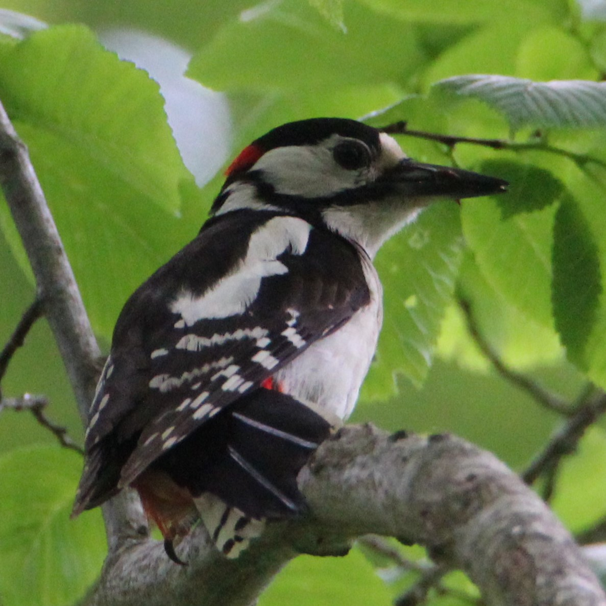

# Hybridation between wild cats and domestic cats

I will work with the

on the species *Felis s. silvestris* and *Felis s. catus* respectively the wild cat and the dosmestic cat.

# R markdown test
This is an example of a simple code :
```R
cat = 0
while cat < 42 : 
  cat = cat + 1 
print(cat)
```

# Add an image
here is a cute spotted woodpecker

> this is a quote
